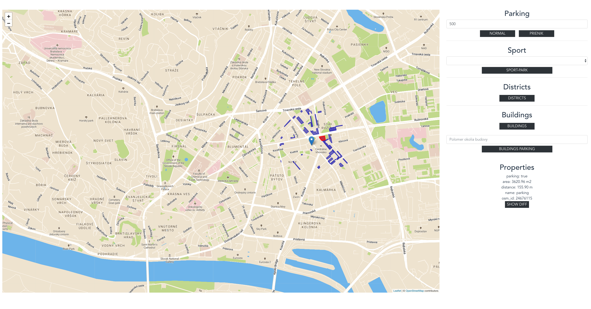
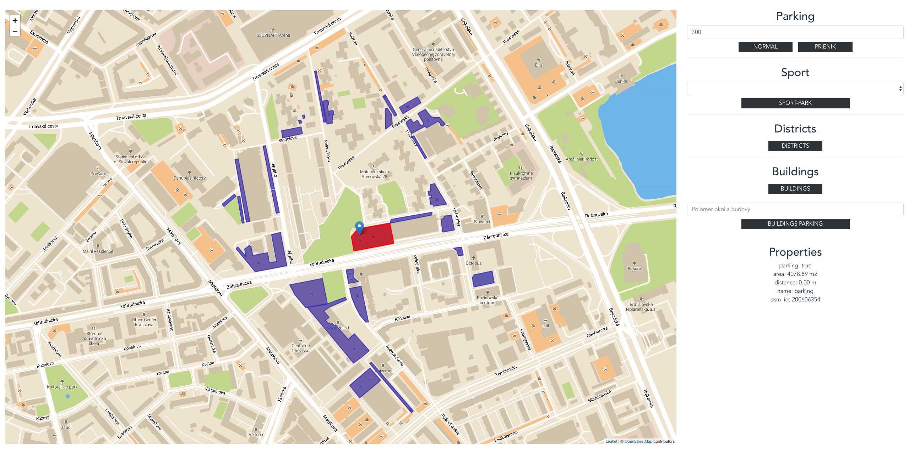
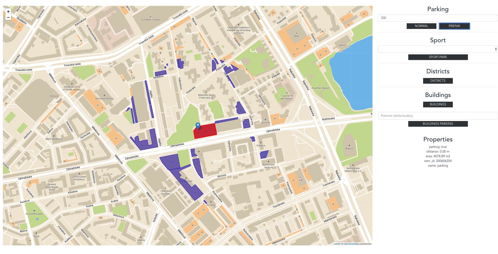
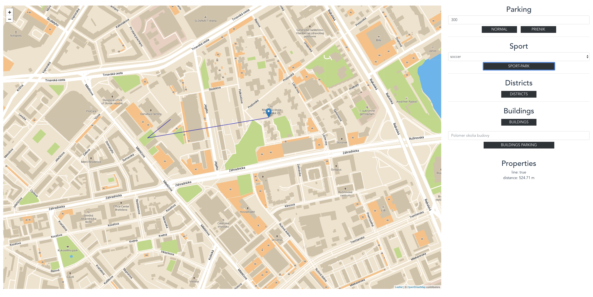
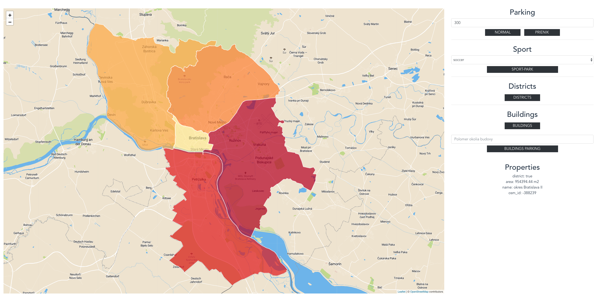
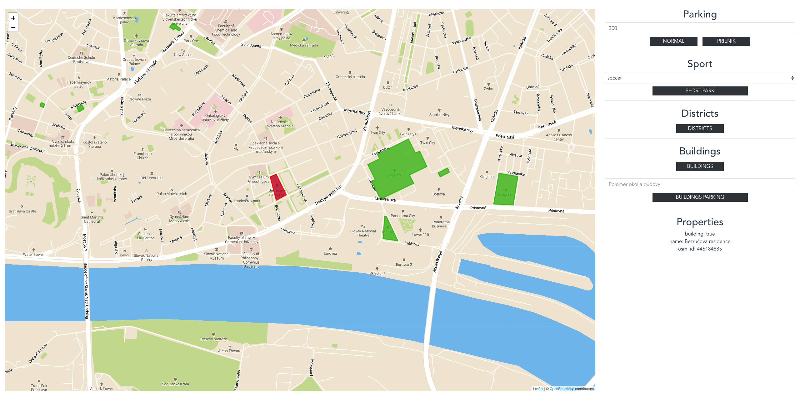
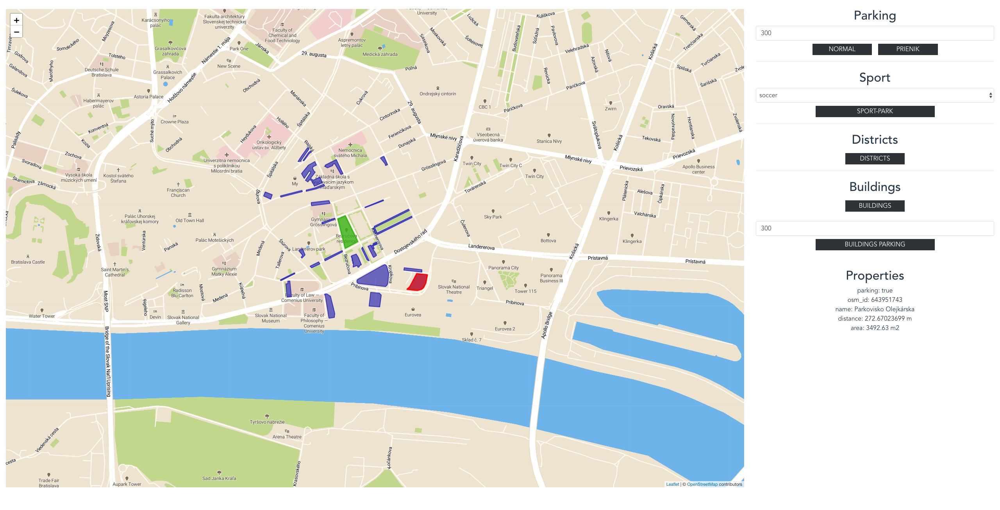
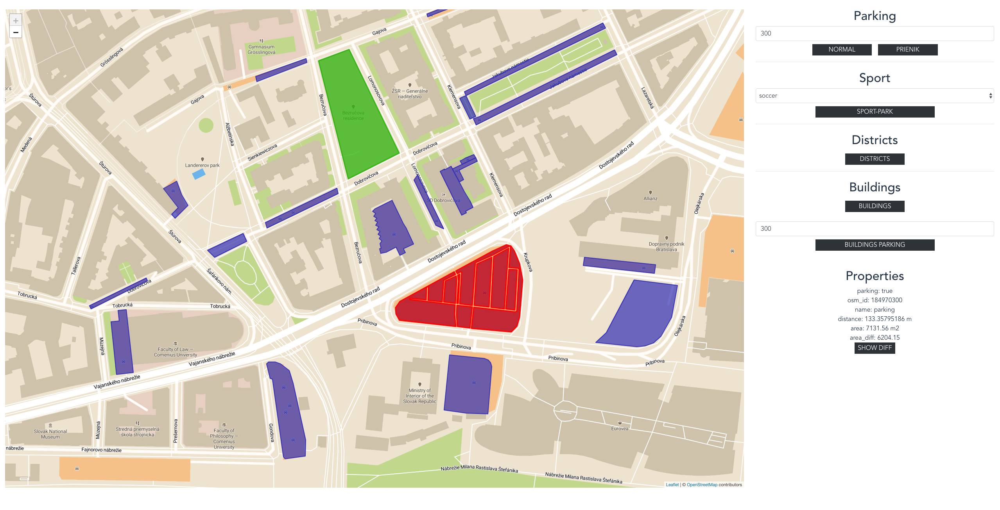

# Prehľad

Aplikácia vyhľadáva a zobrazuje parkoviská v Bratislave a jej okolí. V aplikácií je možné:
- vyhľadať parkoviská v nastavenom okolí od zadanej polohy
- zobraziť parkoviská v jednotlivých mestských častiach Bratislavy
- vyhľadať parkoviská v okolí vybranej novostavby
- BONUS: vyhľadá najkratšiu cestu na vybrané športovisko a následne do parku od zadanej polohy

V aplikácií je následne ku každému parkovisku zobrazovaná rozloha, názov a ak sa jedná o hľadanie v nejakom okolí, tak aj vzdialenosť od zadaného bodu.
Ďalej je možné každé parkovisko zobraziť bez ciest, ktoré obsahuje, teda iba čisto parkovaciu plochu a zobrazí sa aj rozloha tejto plochy v informáciách.

Screenshot z aplikácie:



Aplikácia sa skladá z 3 častí:
- [klientská aplikácia](#frontend) napísanú vo Vue.js, ktorá zobrazuje Leaflet mapu
- postgres [databáza](#data) s postgis
- [backend](#backend) server založený na Node.js, ktorý poskytuje GeoJSON API pre klientskú aplikáciu


# Frontend

Aplikácia bola implementovaná vo frameworku [Vue](https://vuejs.org/). Pre zobrazenie mapy bola využitá knižnica [Leaflet](https://leafletjs.com/).
Základ mapy je z [mapboxu](https://www.mapbox.com/), pričom bola upravená na [vlastný štýl](https://api.mapbox.com/styles/v1/matefko/cjp77kzwj3lvp2sqjkvowuy6w.html?fresh=true&title=true&access_token=pk.eyJ1IjoibWF0ZWZrbyIsImEiOiJjam5ycXNnbzYwYTdyM3BsOG55MnhyaHI1In0.bemuMa-aC4Cj3MeCGQeXfg#17.5/48.133650/17.101351/0). Boli pridané parkoviská (zvýraznené na mape a pridaná ikona), zobrazujú sa všetky cesty.
Na prepojenie Leaflet mapy a Vue.js frameworku bola použitá knižnica [Vue2Leafle](https://www.npmjs.com/package/vue2-leaflet).

# Backend

Backend server je napísaný v [Node.js](https://nodejs.org/en/) a je zodpovedný za získavanie dát z databázy, ktoré poskytuje klientskej aplikácií prostredníctvom REST API.
Na pripojenie k PostgreSQL databáze bol použitý modul [node-postgres](https://node-postgres.com/). Server upravuje dáta do správneho GeoJSON formátu, predtým ako sú poskytnuté klientskej aplikácií.


## Data

Dáta pochádzajú z OpenStreetMap a boli importnuté pomocou nástroja [osm2pgsql](https://wiki.openstreetmap.org/wiki/Osm2pgsql) do štandardnej OSM schémy.
Stiahnutá bola oblasť Bratislavy a blízkeho okolia (asi 660MB). Dáta boli dodatabázy importované v 4326 projekcií. 

### Práca s dátami

Pre zlepšenie výkonu bol nad každým geometry stĺpcom `way` vytvorený index. V tabuľke planet_osm_polygon vytvorený index aj nad funkciou `geography(way)`.
Všetky indexy nad tabuľkou planet_osm_polygon
```sql
CREATE INDEX polygon_admin_idx ON planet_osm_polygon (admin_level);
CREATE INDEX polygon_amenity_idx ON planet_osm_polygon (amenity);
CREATE INDEX polygon_geo_gix ON planet_osm_polygon (geography(way));
CREATE INDEX polygon_leisure_idx ON planet_osm_polygon (leisure);
CREATE INDEX polygon_osm_idx ON planet_osm_polygon (osm_id);
```

Pre zobrazenie 10 najviac zastúpených športoch v mape bolo vytvorené view so všetkými športami. Názvy športov museli byť upravené,
pretože v niektorých prípadoch ich bolo na jednom športovisku viac a boli oddelené `;`.
```sql
create materialized view sport_places as
  SELECT sub.osm_id,
         sub.leisure,
         sub.name,
         sub.sport,
         sub.surface,
         st_setsrid(st_geomfromgeojson(sub.geojson), 4326) AS way
  FROM (SELECT planet_osm_line.osm_id,
               planet_osm_line.leisure,
               planet_osm_line.name,
               regexp_replace(unnest(string_to_array(planet_osm_line.sport, ';' :: text)), '.*hockey.*' :: text,
                              'hockey' :: text)  AS sport,
               planet_osm_line.surface,
               st_asgeojson(planet_osm_line.way) AS geojson
        FROM planet_osm_line
        WHERE (planet_osm_line.sport IS NOT NULL)
        UNION
        SELECT planet_osm_polygon.osm_id,
               planet_osm_polygon.leisure,
               planet_osm_polygon.name,
               regexp_replace(unnest(string_to_array(planet_osm_polygon.sport, ';' :: text)), '.*hockey.*' :: text,
                              'hockey' :: text)     AS sport,
               planet_osm_polygon.surface,
               st_asgeojson(planet_osm_polygon.way) AS geojson
        FROM planet_osm_polygon
        WHERE (planet_osm_polygon.sport IS NOT NULL)
        UNION
        SELECT planet_osm_point.osm_id,
               planet_osm_point.leisure,
               planet_osm_point.name,
               regexp_replace(unnest(string_to_array(planet_osm_point.sport, ';' :: text)), '.*hockey.*' :: text,
                              'hockey' :: text)   AS sport,
               planet_osm_point.surface,
               st_asgeojson(planet_osm_point.way) AS geojson
        FROM planet_osm_point
        WHERE (planet_osm_point.sport IS NOT NULL)) sub;
```

Ďalej bolo vytvorené view, ktoré pre každé športovisko z predchádzahúceho view obsahuje najbližší park v jeho okolí.
```sql
create materialized view sport_park_distance as
  SELECT rnk.sport_osm_id,
         rnk.sport_leisure,
         rnk.sport_name,
         rnk.sport_sport,
         rnk.sport_surface,
         rnk.sport_way,
         rnk.distance,
         rnk.park_osm_id,
         rnk.park_name,
         rnk.park_way,
         rnk.rn
  FROM (SELECT sub.sport_osm_id,
               sub.sport_leisure,
               sub.sport_name,
               sub.sport_sport,
               sub.sport_surface,
               sub.sport_way,
               sub.distance,
               sub.park_osm_id,
               sub.park_name,
               sub.park_way,
               rank() OVER (PARTITION BY sub.sport_osm_id ORDER BY sub.distance) AS rn
        FROM (SELECT s.osm_id                                                AS sport_osm_id,
                     s.leisure                                               AS sport_leisure,
                     s.name                                                  AS sport_name,
                     s.sport                                                 AS sport_sport,
                     s.surface                                               AS sport_surface,
                     s.way                                                   AS sport_way,
                     st_distance((s.way) :: geography, (p.way) :: geography) AS distance,
                     p.osm_id                                                AS park_osm_id,
                     p.name                                                  AS park_name,
                     p.way                                                   AS park_way
              FROM sport_places s,
                   (SELECT planet_osm_polygon.*
                    FROM planet_osm_polygon
                    WHERE (planet_osm_polygon.leisure = 'park' :: text)) p) sub) rnk
  WHERE (rnk.rn = 1);
```


## Api

**Nájdi všetky parkoviská v zadanom okolí od bodu**

`GET /parking_nearby?lat=48.13243808483985&lng=17.101501822471622&perimeter=500`

````sql
WITH point as (SELECT ST_SetSRID(ST_MakePoint($1, $2),4326)::geography), 
     buffer as (SELECT st_buffer((SELECT * FROM point), $3, 64)), 
     distances as (SELECT ROUND(st_distance((SELECT * FROM point), sub.parking_way::geography)::numeric, 2) as distance, sub.*
                   FROM (
                          SELECT p.way as parking_way, p.osm_id, p.name 
                          FROM planet_osm_polygon p
                          WHERE p.amenity = 'parking' and p.way && (SELECT * FROM buffer)
                   ) sub) 
SELECT st_asgeojson(distances.parking_way) as geojson, 
       ROUND(st_area(distances.parking_way::geography)::numeric, 2) as area, 
       distances.distance, distances.name, distances.osm_id 
FROM distances WHERE distance <= $3
````


**Nájdi všetky parkoviská v zadanom okolí od bodu a zobraz ako prienik s okolím**

`GET /parking_nearby_intersect?lat=48.15459673174829&lng=17.11590964347124&perimeter=500`

```sql
WITH point as (SELECT ST_SetSRID(ST_MakePoint($1, $2),4326)::geography), 
     buffer as (SELECT st_buffer((SELECT * FROM point), $3, 64)), 
     intersections as (SELECT ST_Intersection(sub.parking_way, (SELECT * FROM buffer)) AS geom, 
                              ROUND(st_area(sub.parking_way::geography)::numeric, 2) as area,
                              sub.osm_id, 
                              sub.name
                       FROM (
                           SELECT p.way::geography as parking_way, p.osm_id, p.name FROM planet_osm_polygon p
                           WHERE p.amenity = 'parking' and (select * from buffer) && p.way
                       ) sub )
SELECT st_asgeojson(intersections.geom) as geojson, 
       ROUND(st_distance(intersections.geom, (SELECT * from point))::numeric, 2) as distance, 
       intersections.area, 
       intersections.osm_id, 
       intersections.name 
FROM intersections
```


**Nájdi najkratšiu cestu športovisko-park od zadaného bodu**

`GET /sport_park?lat=48.15459673174829&lng=17.11590964347124&sport=basketball`

```sql
WITH sport_park as (SELECT sport_sport as sport, sport_osm_id as osm_id, sport_way, distance, park_way FROM sport_park_distance WHERE sport_sport=$3), 
     point as (SELECT ST_SetSRID(ST_MakePoint($1, $2), 4326) as point),
     point_sport as (SELECT sport_park.osm_id, sport_park.sport_way, st_distance((SELECT * FROM point), sport_park.sport_way) as distance, park_way FROM sport_park), 
     close_sport as (SELECT * FROM point_sport WHERE distance = (SELECT MIN(distance) FROM point_sport) LIMIT 1)
SELECT st_asgeojson(line_sub.line) as geojson, 
       ROUND(st_length(line_sub.line::geography)::numeric, 2) as distance 
FROM (
  SELECT st_linefrommultipoint(st_collect(sub.arr)) as line 
  FROM (
    SELECT ARRAY[(SELECT * FROM point), st_centroid((SELECT sport_way FROM close_sport)), st_centroid((SELECT park_way FROM close_sport))] as arr
    ) sub
  ) line_sub
```


**Zobraz mestské časti Bratislavy**

`GET /districts`
```sql
with districts as (SELECT way, name, osm_id FROM planet_osm_polygon WHERE admin_level = '8' and st_within(way, (SELECT way FROM planet_osm_polygon WHERE admin_level = '6'))),
     parkings as (SELECT * from planet_osm_polygon where amenity = 'parking') 
SELECT ROUND(SUM(st_area(p.way::geography))::numeric, 2) as area, 
       d.name, 
       d.osm_id,
       st_asgeojson(d.way) as geojson 
FROM districts d, parkings p 
WHERE st_contains(d.way, p.way) 
GROUP BY d.osm_id, d.name, d.way
```


**Zobraz parkoviská v mestskej časti**

`GET /district/-388239/parking `

```sql
WITH district as (SELECT way FROM planet_osm_polygon WHERE osm_id = $1)
SELECT st_asgeojson(way) as geojson, 
       name, 
       osm_id, 
       round(st_area(way::geography)::numeric, 2) as area 
FROM planet_osm_polygon 
WHERE amenity = 'parking' and st_contains((SELECT * FROM district), way)
```

**Zobraz novostavby**

`GET /buildings`

```sql
SELECT st_asgeojson(way) as geojson, 
       name, 
       osm_id 
FROM planet_osm_polygon 
WHERE construction IN ('residential', 'apartments')
```


**Zobraz parkoviská v zadanom okolí novostavby**

`GET /building/22959814/parking/500`

```sql
with building as (SELECT way FROM planet_osm_polygon WHERE osm_id = $1), 
     buffer as (SELECT st_buffer((SELECT * FROM building)::geography, $2, 64))
SELECT st_asgeojson(p.way) as geojson, 
       p.osm_id, 
       p.name, 
       st_distance(p.way::geography, (SELECT * FROM building)) as distance,
       round(st_area(p.way::geography)::numeric, 2) as area 
FROM planet_osm_polygon p
WHERE p.amenity = 'parking' AND st_intersects(p.way, (SELECT * FROM buffer))
```


**Zobraz parkovisko bez ciest (šírka cesty 1,8m)**

`GET /parking/29062045/diff`

```sql
with roads as (SELECT p.osm_id, p.way, r.osm_id, r.highway, r.name, r.way as aisle
               FROM planet_osm_polygon p
               JOIN planet_osm_roads r ON st_intersects(p.way, r.way)
               WHERE p.osm_id = $1
               UNION
               SELECT p.osm_id, p.way, l.osm_id, l.highway, l.name, l.way as aisle
               FROM planet_osm_polygon p
               JOIN planet_osm_line l ON st_intersects(p.way, l.way)
               WHERE p.osm_id = $1), 
     difference as (SELECT st_difference(way, st_buffer(st_intersection(st_union(aisle), way)::geography, 0.9)::geometry) as diff FROM roads GROUP BY way) 
SELECT round(st_area(diff::geography)::numeric, 2) as area_diff, 
        st_asgeojson(diff) as geojson 
FROM difference
```


### Response

API vracia pole json objektov v tvare napr:
```
[ { type: 'Feature',
    geometry: { type: 'Polygon', coordinates: [Array] },
    properties: 
     { parking: true,
       osm_id: '534566267',
       name: 'parking',
       distance: '498.82701814 m',
       area: '191.61 m2' } },
  { type: 'Feature',
    geometry: { type: 'Polygon', coordinates: [Array] },
    properties: 
     { parking: true,
       osm_id: '534566266',
       name: 'parking',
       distance: '487.54621782 m',
       area: '186.94 m2' } },
       ...
```
Pole coordinates bolo kvôli prehľadnosti zjednodušené. Kľúč geometry v odpovedi je vytvorený pomocou `st_asgeojson` funckie.
